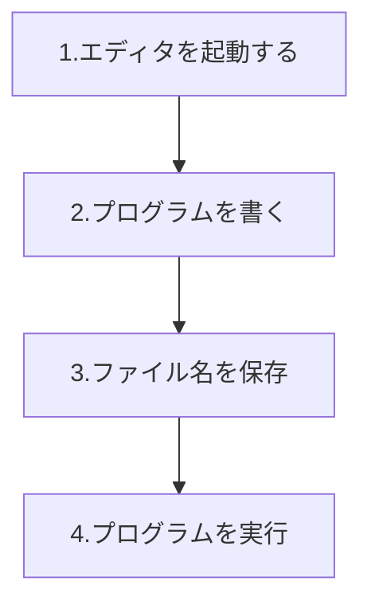
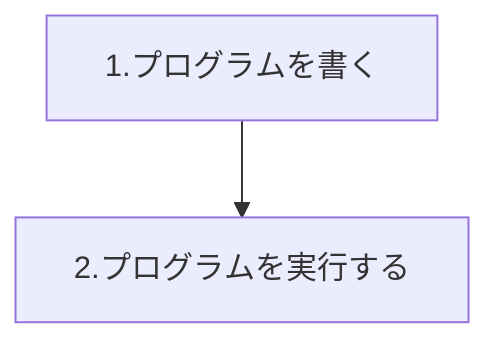

# Pythonの基本


Pythonってなに？

## Pythonとは


Pythonもプログラミング言語の仲間です。


Pythonは、**スクリプト言語**や**軽量言語**と呼ばれる言語です。

コレはどういったことかと言うと！


プログラムを作ったらすぐに動かすことが可能な言語ということです。

コンパイルや最適化などの作業が必要がありません。


Pythonはいろいろな種類のコンピュータで動くことが可能です。

Windows,Mac,Linuxなどの環境で動かすことが可能です。

もちろん、スマホなどの上で動くことも可能です。


### Pythoは覚えやすい


プログラムは決まったルールに従って書く必要がります。

プログラミング言語の持っているルールを**文法**と呼びます。

Pythonは、他の言語にに比べるとPythonの文法はとてもシンプルです。


#### 予約語も少ない

プログラム言語はたいてい**予約語**と呼ばれるものを持っている。

予約語とは・・・プログラムで使う命令のうち、基本となる命令などを集めたものです。


予約後の比較

| 言語       | 予約語の数 |
| ---------- | ---------- |
| Python     | 33         |
| Ruby       | 41         |
| Perl       | 約220      |
| Java       | 52         |
| JavaScript | 61         |


予約語だけではなく、Pythonではプログラムを書くための約束事がシンプルです。


### Pythonは使いやすい


世界中で使われているクラウド「Dropbox」はPythonで使われています。

Googleなども積極的にPythonを使用を勧めている企業です。


Pythonがなぜ使われているか？それは、Pythonga持っている**標準ライブラリ**という仕組みがたくさんあるからです。

標準ライブラリには、プログラムでよく使う部分がたくさん詰め込まれています。

この機能を使うことで、面倒なプログラムを書かなくても、カンタンにプログラムを作ることができます。


ただ、ソースコードは書かないといけないので、その点は注意してください。


### Pythonのソースコードは読みやすい


プログラムの読みやすさのことを**可読性**(かどくせい)といいます。

可読性が高く読みやすいプログラムは、楽に修正や機能追加を行えます。

Pythonはそんな可読性が高く、読みやすい言語の一つです。


## Pythonを動かすには２種類の方法がある


プログラム書き方には**文法**と呼ばれる簡単なルールがあります。

Pythonにも文法があります。

Pythonではプログラムを作る時にには、Pythonの文法に従って文字を書いていきます。


文法に従って書かれたプログラムのことを**ソースコード**や**コード**と呼びます。


### プログラム記述型


Pythonはプログラミング言語のなかでも**スクリプト言語**に分類されます。

スクリプト言語では、プログラムを実行する場合、たいていはプログラムを書いた**ファイル**を用意します。

ファイルに書いたコードをスクリプト言語が読み込むという手順です。





### インタラクティブ(対話型)シェル


**インタラクティブシェル**を使うと、いちいちファイル名を考えてファイルを作るようなことをせず

思いついたらすぐに、Pythonのコードを実行できる点で便利です。




### キーボードからコードを入力する


キーボードから文字を打ち込んでPythonを操作してみます。


```python
print("キーボードから入力")
```

**print()命令の実行**


print()を書かなくても同じ結果が表示されます


```python
print(1+1)
1  + 1
```

**print()命令を記述しなくても同じ結果に**